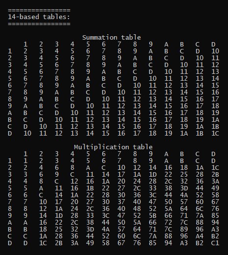

# Experimental pieces of code

| Module | Description |
 ------ | ------ |
| [sum_and_mult_tables_in_diff_bases.py](sum_and_mult_tables_in_diff_bases.py) | Console utility.<br />Generates multiplication and summation tables based on given number system.<br /> Run it as a usual module, e.g.: ```python sum_and_mult_tables_in_diff_bases.py```<br /><br />|
